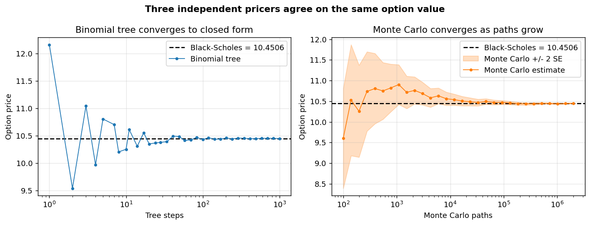

# Options Pricing Engine

A C++ options pricing engine with a Python interface. The numerical core is
written in C++ for speed and numerical control; a thin
[pybind11](https://github.com/pybind/pybind11) layer exposes it to Python so
that validation, plotting, and benchmarking can be done from notebooks — the
same split used in production quant systems (fast C++ core, Python research
layer).

## Status

| Component | Status |
|---|---|
| Black-Scholes-Merton closed form + Greeks | done |
| pybind11 Python bindings | done |
| C++ test suite + Python cross-validation | done |
| Binomial tree pricer (European + American) | done |
| Monte Carlo pricer (antithetic variance reduction) | done |
| Three-method convergence test | done |
| Implied-volatility solver | planned |
| Latency benchmarks + vol-surface plots | planned |

## The model

For a European option under Black-Scholes-Merton with continuous dividend
yield `q`:

```
d1 = [ ln(S/K) + (r - q + sigma^2 / 2) T ] / (sigma sqrt(T))
d2 = d1 - sigma sqrt(T)

Call = S e^{-qT} N(d1) - K e^{-rT} N(d2)
Put  = K e^{-rT} N(-d2) - S e^{-qT} N(-d1)
```

The Greeks (delta, gamma, vega, theta, rho) are computed analytically rather
than by bumping inputs, so they are exact and cheap. The normal CDF uses
`std::erfc`, which is stable across the whole real line. Degenerate inputs
(`T <= 0` or `sigma <= 0`) fall back to discounted intrinsic value.

## Three pricing methods, cross-checked

The engine prices the same option three independent ways, which is how the
results are validated against each other:

- **Closed form** (Black-Scholes-Merton) — exact, instant, European only.
- **Binomial tree** (Cox-Ross-Rubinstein) — converges to the closed form for
  European options, and also prices **American** options via early-exercise
  checks at every node, where no closed form exists.
- **Monte Carlo** — simulates terminal prices under risk-neutral geometric
  Brownian motion. Uses antithetic variates to cut variance, and reports a
  **standard error** so the estimate comes with a confidence band rather than
  a false sense of exactness.

All three agree on the same option value:



The test suite also confirms the tree reproduces known American-option facts:
an American put is worth strictly more than the European put (the early-exercise
premium), while an American call on a non-dividend stock equals the European
call.

## Layout

```
include/ope/types.hpp           shared types (inputs, option type, exercise style)
include/ope/black_scholes.hpp   closed-form interface + Greeks
include/ope/binomial.hpp        binomial tree interface
include/ope/monte_carlo.hpp     Monte Carlo interface
src/                            implementations
bindings/bindings.cpp           pybind11 module definition
tests/test_black_scholes.cpp    closed-form references + put-call parity
tests/test_convergence.cpp      tree/MC convergence + American-option checks
python/validate.py              cross-check vs independent SciPy reference
python/convergence.py           generates the convergence chart above
CMakeLists.txt                  build for lib, tests, and Python module
```

## Build

Requires a C++20 compiler, CMake >= 3.18, and pybind11 (`pip install pybind11`).

```bash
cmake -S . -B build -DCMAKE_PREFIX_PATH="$(python -m pybind11 --cmakedir)"
cmake --build build -j

# C++ tests
ctest --test-dir build --output-on-failure

# Python cross-validation
PYTHONPATH=build python python/validate.py
```

## Use from Python

```python
import ope

inp = ope.BSInputs(spot=100, strike=100, rate=0.05,
                   vol=0.20, maturity=1.0, type=ope.OptionType.Call)

# Closed form + Greeks
g = ope.black_scholes(inp)
print(g.price, g.delta, g.vega)

# Binomial tree (European or American)
print(ope.binomial_price(inp, steps=1000, exercise=ope.Exercise.European))
print(ope.binomial_price(inp, steps=1000, exercise=ope.Exercise.American))

# Monte Carlo with standard error
mc = ope.monte_carlo_price(inp, num_paths=1_000_000)
print(mc.price, mc.std_error)
```

Regenerate the convergence chart with:

```bash
PYTHONPATH=build python python/convergence.py
```
